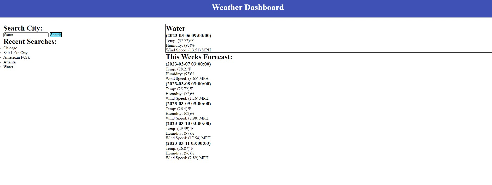

# weatherbusiness

## Screenshots

  ## License
  
  ## Description
  A weather app for displaying the weather of a city by search.
  ## Table of Contents
- [weatherbusiness](#weatherbusiness)
  - [Screenshots](#screenshots)
  - [License](#license)
  - [Description](#description)
  - [Table of Contents](#table-of-contents)
  - [Installation](#installation)
  - [Usage](#usage)
  - [Contributions](#contributions)
  - [Test Instructions](#test-instructions)
  - [Contact](#contact)
  ## Installation
  n/a
  ## Usage
  Just go to the website and search a city.
  ## Contributions
  n/a
  ## Test Instructions
  n/a
  ## Contact
  * GitHub: https://github.com/Ikomeda/
  * Email: n/a